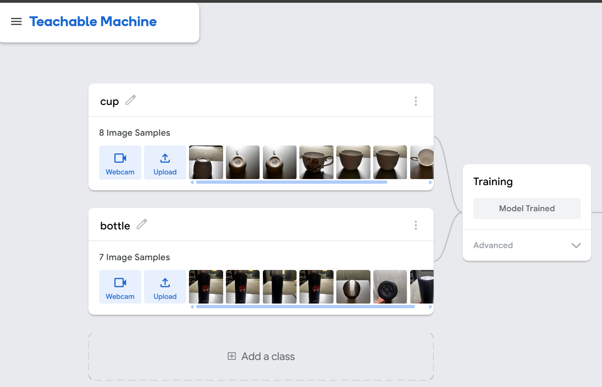
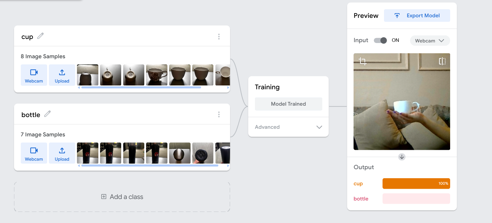

# Day 6 — Image Classification with Teachable Machine 🤖

As part of my AI/ML learning journey, I explored **image classification using Google Teachable Machine**.

This was a hands-on experiment focused on understanding how **training data quantity and quality affect machine learning predictions**.

## 🎯 Objective

To build a simple image classification model that distinguishes between two objects:

- ☕ Cup
- 🧴 Bottle

And observe how the model behaves when the training data is changed.

---

## 🛠️ Tool Used

- Google Teachable Machine
- Webcam
- No-code machine learning

---

## 🔬 Experiment

### 1. Initial Training

I created two classes:

| Class | Training Images |
|---|---:|
| Cup | 8 |
| Bottle | 7 |

I trained the model and tested it using the webcam.



### 2. Correct Prediction

When a cup was shown to the model, it correctly predicted:

```text
Cup: 100%
Bottle: 0%
```



### 3. Adding More (Imbalanced/Inconsistent) Data

I added more images to the **Cup** class — bringing it up to 22 samples — while the **Bottle** class stayed at 7. Some of the newly added "cup" images were inconsistent (blurry shots, unrelated objects like a remote control), simulating noisy training data.

| Class | Training Images (Updated) |
|---|---:|
| Cup | 22 |
| Bottle | 7 |

### 4. Misclassification After Noisy/Imbalanced Data

After retraining, I tested the model with an actual **bottle** in front of the webcam. Instead of correctly identifying it, the model predicted:

```text
Cup: 100%
Bottle: 0%
```

The model confidently misclassified the bottle as a cup — something it hadn't done with the original balanced, clean dataset.

---

## 📊 Observations

1. **A balanced, clean dataset gave accurate results.** With 8 cup images and 7 bottle images, the model correctly identified both objects with 100% confidence.

2. **Adding more data isn't automatically better — imbalance and noise broke the model.** Growing the cup class to 22 images (including inconsistent/irrelevant samples) while leaving bottle at 7 caused the model to misclassify an actual bottle as a cup with full confidence.

3. **Data quality and balance matter more than raw volume.** The model didn't get "less confident" with bad data — it got confidently wrong. This showed me that a smaller, clean, balanced dataset can outperform a larger but noisy or lopsided one.

---

## 💡 Key Learning

> More data doesn't always mean a better model — **the quality and balance of training data matter just as much.**

This hands-on experiment helped me better understand the importance of **data quality, generalization, and model reliability** in machine learning — concepts that apply far beyond image classification, to any ML system that learns from data.

---
*Day 6 of the ABTalks 60-day AI challenge — Artificial Intelligence track*
