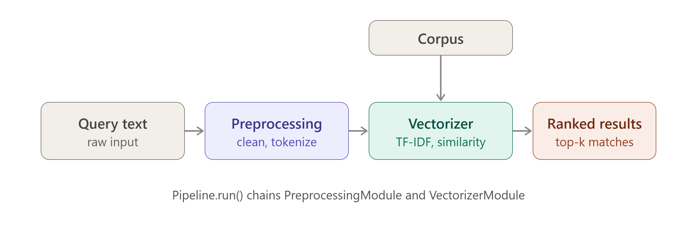

# Day 10 — Build Your First End-to-End NLP Pipeline 🔗

As part of my AI/ML learning journey, I refactored the preprocessing and vectorization work from Days 8–9 into a modular, reusable NLP pipeline.

## 🎯 Objective

Turn standalone preprocessing and similarity-scoring code into three cleanly separated, independently testable components: a `PreprocessingModule`, a `VectorizerModule`, and a `Pipeline` class that chains them together.

## 🏗️ Architecture

A raw query flows into `PreprocessingModule` for cleaning and tokenization, then into `VectorizerModule` (which is also fit on the corpus) for TF-IDF vectorization and cosine similarity scoring, producing a ranked list of results.

## 🧩 Components

### `PreprocessingModule`
- `transform(text)` — lowercases, strips punctuation, removes stopwords, and lemmatizes a raw string.
- Configurable via `remove_stopwords` and `lemmatize` parameters.

### `VectorizerModule`
- `fit(corpus)` — fits a TF-IDF vectorizer on a list of preprocessed documents.
- `transform(query)` — vectorizes a single query string.
- `similarity(query_vector)` — returns cosine similarity scores against the fitted corpus.

### `Pipeline`
- `fit(corpus)` — preprocesses and fits the vectorizer on a corpus.
- `run(query, corpus, top_k)` — runs the full flow: preprocess → vectorize → rank by similarity, with built-in error handling for empty strings, single-character queries, and numbers/symbols-only input.

## 🔬 Testing

Ran the pipeline against 5 different queries on a 15-document corpus spanning pets, technology, and travel topics — each returning ranked results with similarity scores.

Also tested 3 edge cases to confirm the pipeline fails gracefully:
- Empty string input
- Single-character queries
- Numbers/symbols-only input

All three correctly raised a `ValueError` with a clear message instead of crashing or returning meaningless results.

## 💡 Design Decision: Why Modular Components

Splitting preprocessing, vectorization, and orchestration into separate classes makes the system far easier to debug and extend than a single monolithic script:

- **Isolated debugging** — if similarity scores look wrong, I can test `VectorizerModule` alone without re-running preprocessing, immediately narrowing down where the bug lives.
- **Independent testing** — each module has a single responsibility, so it can be unit tested in isolation with its own inputs and expected outputs.
- **Easier extension** — swapping TF-IDF for embeddings later only means changing `VectorizerModule`; the `Pipeline` interface and `PreprocessingModule` stay untouched.
- **Reusability** — `PreprocessingModule` and `VectorizerModule` can now be reused independently in future days' tasks, rather than duplicating logic each time.

This is the same principle behind why large systems are built from small, well-defined services rather than one giant script — smaller pieces with clear boundaries are easier to reason about, test, and change safely.

---
*Day 10 of the ABTalks 60-day AI challenge — Artificial Intelligence track*
