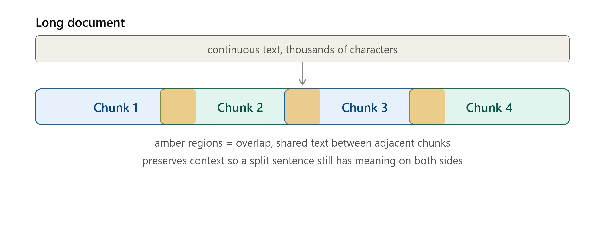

# Day 12 — Chunking Strategies for Long Document Processing ✂️

Built and compared multiple chunking strategies for splitting long documents into pieces suitable for LLM context windows and retrieval systems.

## 🎯 Objective

Understand how chunk design (size and overlap) affects retrieval quality, by comparing manual fixed-size chunking against LangChain's recursive character splitting across 12 configurations.

## 🏗️ Approach

- Loaded a long Wikipedia article (5+ pages) as the source document
- **Fixed-size chunking** — implemented manually with a loop, splitting text every N characters with configurable overlap, to understand the raw mechanics
- **Recursive character splitting** — used LangChain's `RecursiveCharacterTextSplitter`, which tries to cut at paragraph, then line, then sentence boundaries before falling back to arbitrary character cuts
- Ran the same retrieval query against **12 configurations**: chunk sizes of 100, 300, 500, and 1000 characters, each with overlaps of 0, 50, and 100 characters
- Compared which configuration returned the most contextually complete result

## 📊 Boundary Failures

Found and documented three specific examples where fixed-size chunking split a sentence mid-thought, including the exact character position of each split — a direct consequence of cutting by character count with no awareness of sentence structure.

## 💡 Recommendation

**500-character chunks with 100-character overlap** produced the most contextually complete retrieval result:
- 100-character chunks were too small — frequently splitting a single idea across multiple chunks
- 1000-character chunks were too large — diluting the query's signal across unrelated text
- 500 characters with 100 overlap balanced completeness and topical focus, and the overlap ensured that even a mid-boundary split left enough leading context in the next chunk to stay interpretable
- Zero overlap consistently produced the most broken sentences at chunk boundaries

## 🖼️ Chunking with overlap

The shaded regions show the overlap shared between adjacent chunks — this is what preserves meaning when a sentence gets split across a boundary.

---
*Day 12 of the ABTalks 60-day AI challenge — Artificial Intelligence track*
